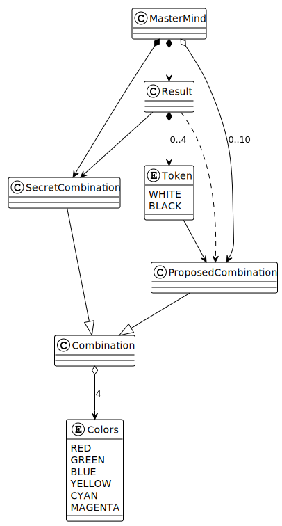
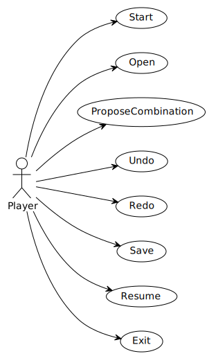
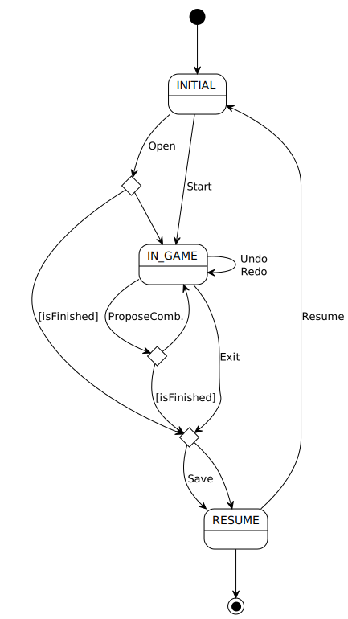
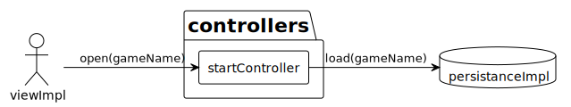
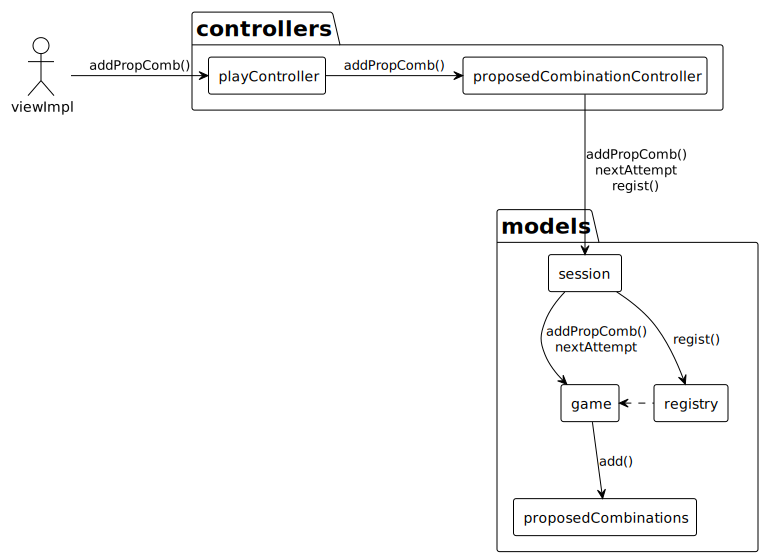
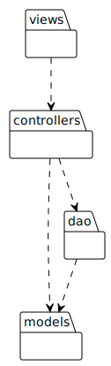
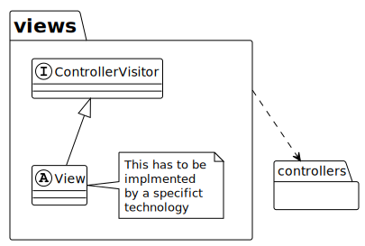
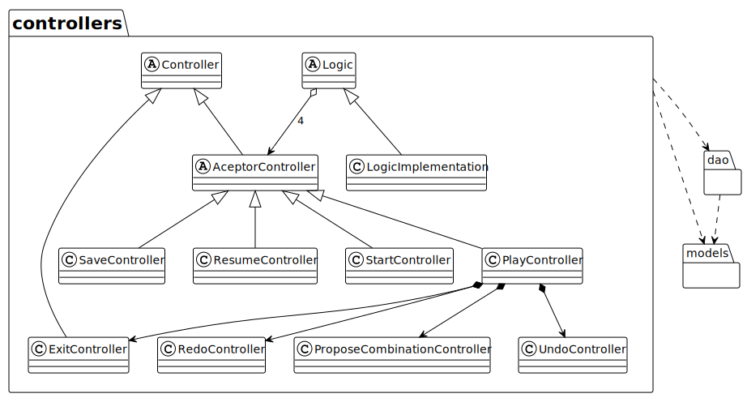
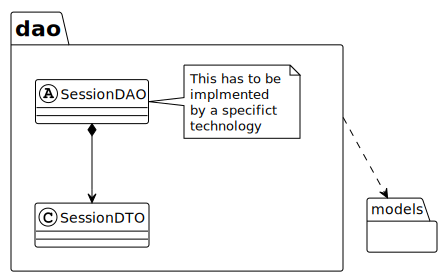
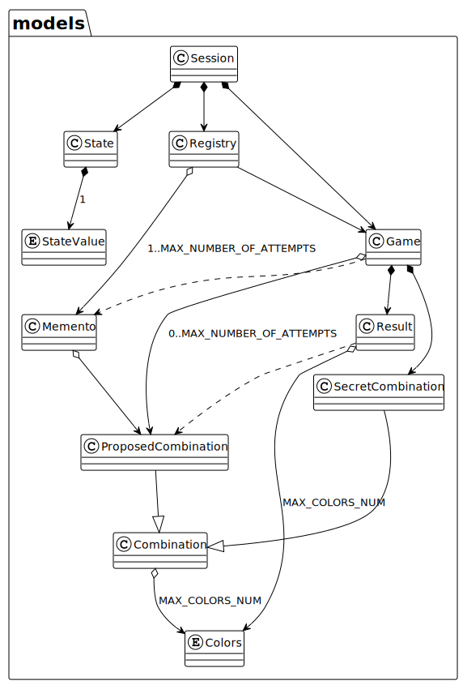

# Master Mind Application Core

### Index
- **[Application development](#application-development)**
- **[Documentation](#documentation)**
  - **[Domain Model](#domain-model)**
  - **[Use Case](#use-case)**
  - **[Context Diagram](#context-diagram)**
  - **[Colaboration Diagram 'Open Case'](#colaboration-diagram-open-case)**
  - **[Colaboration Diagram 'ProposeCopmbination Case'](#colaboration-diagram-proposecombination-case)**
  - **[Architecture](#architecture)**
  - **[View Analysis Diagram](#view-analysis-diagram)**
  - **[Controllers Analysis Diagram](#controllers-analysis-diagram)**
  - **[DAOs Analysis Diagram](#daos-analysis-diagram)**
  - **[Models Analysis Diagram](#models-analysis-diagram)**

## Application development

The core of the application was developed in Java. This module contains the model logic and a layer of controllers that are responsible for controlling the flow of program execution, as well as managing data entry and exit of the application.  
The core of the application is agnostic to thetechnologies of view and persistence, which is why controllers are coupled to interfaces of the view and persistence layers (DAO), within same component, which must be implemented by each corresponding technology.

The application coreis packaged to be imported as a maven dependency.  
This component exposes two interfaces, one for the view technology and another for the persistence.

## Documentation

### Domain Model

### Use Case

### Context Diagram

### Colaboration Diagram 'Open Case'

### Colaboration Diagram 'ProposeCombination Case'

### Architecture

### View Analysis Diagram

### Controllers Analysis Diagram

### DAOs Analysis Diagram

### Models Analysis Diagram

